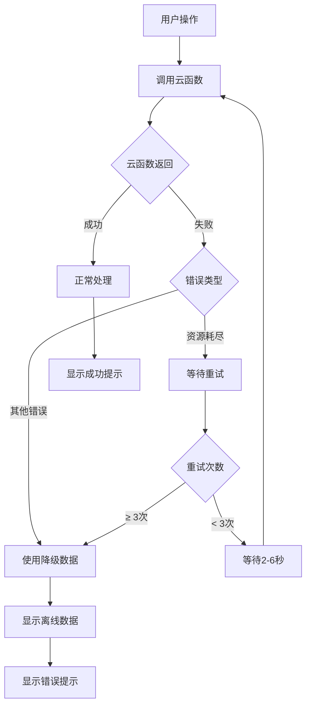

# 羽毛球记分小程序 - 错误处理机制

## 🚨 问题描述

当云函数返回数据库资源耗尽错误时：
```json
{
    "success": true,
    "data": {
        "code": -1,
        "message": "初始化失败",
        "error": "DB read action failed, resource exhausted."
    }
}
```

## 🛠️ 解决方案

### 1. 云函数层面错误处理

#### 数据库操作重试机制
```javascript
// 数据库操作重试函数
async function retryDatabaseOperation(operation, maxRetries = 3, delay = 1000) {
  for (let i = 0; i < maxRetries; i++) {
    try {
      return await operation();
    } catch (error) {
      // 检查是否是资源耗尽错误
      if (error.message && error.message.includes('resource exhausted')) {
        if (i === maxRetries - 1) {
          throw new Error('数据库资源耗尽，请稍后重试');
        }
        // 等待更长时间后重试
        await new Promise(resolve => setTimeout(resolve, delay * (i + 1) * 2));
      } else {
        throw error;
      }
    }
  }
}
```

#### 安全的数据库查询
```javascript
// 安全的数据库查询函数
async function safeDbQuery(collection, operation) {
  return await retryDatabaseOperation(async () => {
    return await operation(collection);
  });
}
```

### 2. 前端层面错误处理

#### 自动重试机制
```javascript
export async function getPlayers() {
  const maxRetries = 3;
  
  for (let i = 0; i < maxRetries; i++) {
    try {
      // 调用云函数
      const result = await uniCloud.callFunction({...});
      
      if (result.result.code === 0) {
        return result.result.data;
      } else {
        // 检查是否是资源耗尽错误
        if (result.result.message && result.result.message.includes('资源耗尽')) {
          if (i < maxRetries - 1) {
            // 等待后重试
            await new Promise(resolve => setTimeout(resolve, (i + 1) * 2000));
            continue;
          }
        }
        
        // 使用降级数据
        return getFallbackPlayers();
      }
    } catch (error) {
      // 重试逻辑
      if (i < maxRetries - 1) {
        await new Promise(resolve => setTimeout(resolve, (i + 1) * 2000));
      }
    }
  }
  
  // 所有重试都失败，使用降级数据
  return getFallbackPlayers();
}
```

#### 降级数据方案
```javascript
// 降级数据：默认队员列表
function getFallbackPlayers() {
  return ['吉志', '小鲁', '建华', '汪骏', '杭宁'];
}
```

### 3. 用户界面优化

#### 加载状态提示
```javascript
uni.showLoading({
  title: '正在初始化数据...'
})

// 操作完成后
uni.hideLoading()
```

#### 错误提示优化
```javascript
uni.showToast({
  title: '网络异常，使用离线数据',
  icon: 'none',
  duration: 3000
})
```

## 📊 错误处理流程



## 🔧 重试策略

| 重试次数 | 等待时间 | 适用场景 |
|---------|---------|----------|
| 第1次 | 2秒 | 数据库资源耗尽 |
| 第2次 | 4秒 | 网络超时 |
| 第3次 | 6秒 | 服务器繁忙 |
| 失败后 | 降级数据 | 所有重试失败 |

## 🎯 优化效果

### 用户体验提升
- ✅ **自动重试**：用户无需手动重试
- ✅ **降级数据**：即使网络异常也能正常使用
- ✅ **友好提示**：清晰的错误信息和建议
- ✅ **加载状态**：用户知道系统正在处理

### 系统稳定性
- ✅ **容错能力**：数据库异常不影响基本功能
- ✅ **资源优化**：避免频繁请求导致资源耗尽
- ✅ **智能重试**：根据错误类型调整重试策略
- ✅ **降级方案**：确保核心功能可用

## 🧪 测试方法

1. **访问测试页面**：`pages/test`
2. **点击"测试错误处理"**：验证错误处理机制
3. **查看控制台**：观察重试过程和降级逻辑
4. **检查用户提示**：确认错误信息友好

## 📝 注意事项

1. **重试间隔**：避免过于频繁的重试导致资源进一步耗尽
2. **降级数据**：确保降级数据能支持基本功能
3. **用户提示**：错误信息要用户友好，避免技术术语
4. **日志记录**：详细记录错误信息便于问题排查

---

**总结**：通过多层错误处理机制，确保即使在数据库资源耗尽的情况下，用户仍能正常使用羽毛球记分小程序的基本功能。
